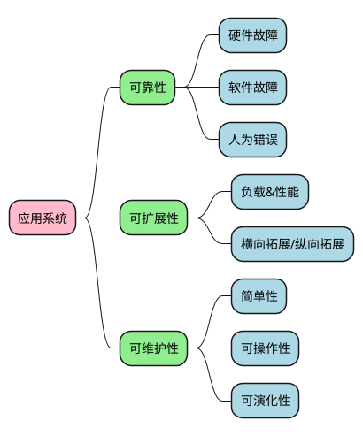
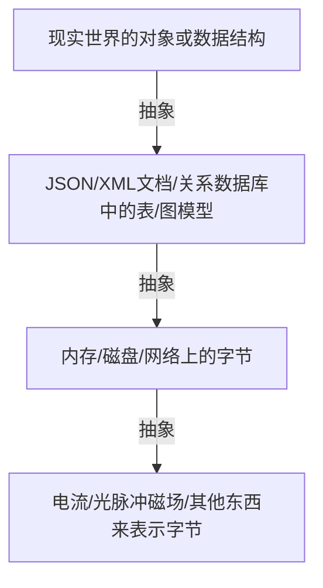
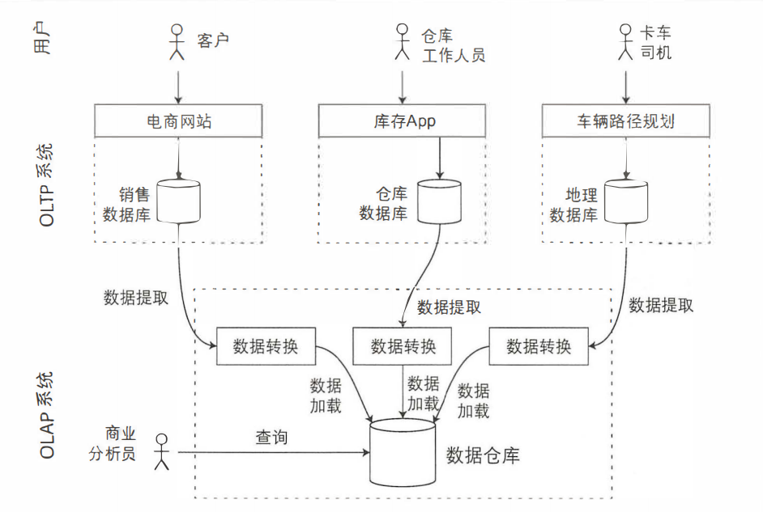

---
# try also 'default' to start simple
theme: seriph
# random image from a curated Unsplash collection by Anthony
# like them? see https://unsplash.com/collections/94734566/slidev
background: https://source.unsplash.com/collection/94734566/1920x1080
# apply any windi css classes to the current slide
class: 'text-center'
# https://sli.dev/custom/highlighters.html
highlighter: shiki
# show line numbers in code blocks
lineNumbers: false
# some information about the slides, markdown enabled
info: |
  ## Slidev Starter Template
  Presentation slides for developers.

  Learn more at [Sli.dev](https://sli.dev)
# persist drawings in exports and build
drawings:
  persist: false
---

# 《设计数据密集型应用》-第一部分读书分享

原名：[《Designing Data-Intensive Applications》](https://www.oreilly.com/library/view/designing-data-intensive-applications/9781491903063/)

<div class="pt-12">
  <span @click="$slidev.nav.next" class="px-2 py-1 rounded cursor-pointer" hover="bg-white bg-opacity-10">
    go on <carbon:arrow-right class="inline"/>
  </span>
</div>

<div class="abs-br m-6 flex gap-2">
  <button @click="$slidev.nav.openInEditor()" title="Open in Editor" class="text-xl icon-btn opacity-50 !border-none !hover:text-white">
    <carbon:edit />
  </button>
  <a href="https://github.com/Vonng/ddia" target="_blank" alt="GitHub"
    class="text-xl icon-btn opacity-50 !border-none !hover:text-white">
    <carbon-logo-github />
  </a>
</div>
<!--
The last comment block of each slide will be treated as slide notes. It will be visible and editable in Presenter Mode along with the slide. [Read more in the docs](https://sli.dev/guide/syntax.html#notes)
-->

---

# 这是一本什么样的书？

[豆瓣](https://book.douban.com/subject/30329536/)评分高达 9.7 分。 关于数据库、分布式系统。 注定要成为经典的书。


---

# 这本书带给我的收获

1. 读完这本书，之后在读很多数据库和分布式系统相关的文章会轻松很多。
2. 脑海中第一次有了完整的数据系统体系。
3. 这本书可以帮助你在架构选型时，知道你选择的组件有哪些合适的场景，而不至于掉到坑里。


<Tweet id="1491177640660996100" scale="0.45" />


---

# 全书分为三大部分

   - 第一部分，主要讨论有关增强数据密集型应用系统所需的若干基本原则。首先开篇第1章即瞄准目标：可靠性、可扩展性与可维护性，如何认识这些问题以及如何达成目标。第2章我们比较了多种不同的数据模型和查询语言，讨论各自的适用场景。接下来第3章主要针对存储引擎，即数据库是如何安排磁盘结构从而提高检索效率。第4章转向数据编码（序列化）方面，包括常见模式的演化历程。

   - 第二部分，我们将从单机的数据存储转向跨机器的分布式系统，这是扩展性的重要一步，但随之而来的是各种挑战。所以将依次讨论数据远程复制（第5章）、数据分区（第6章）以及事务（第7章）。接下来的第8章包括分布式系统的更多细节，以及分布式环境如何达成一致性与共识（第9章）。

   - 第三部分，主要针对产生派生数据的系统，所谓派生数据主要指在异构系统中，如果无法用一个数据源来解决所有问题，那么一种自然的方式就是集成多个不同的数据库、缓存模块以及索引模块等。首先第10章以批处理开始来处理派生数据，紧接着第11章采用流式处理。第12章总结之前介绍的多种技术，并分析讨论未来构建可靠、可扩展和可维护应用系统可能的新方向或方法。

---

# 读书之前，先读目录

## 第一部分：数据系统的基石
- 📝 **第一章：可靠性、可伸缩性、可维护性** 
  - 关于数据系统的思考
  - 可靠性
  - 可伸缩性
  - 可维护性
  - 本章小结
- 📤 **第二章：数据模型与查询语言**
  - 关系模型与文档模型
  - 数据查询语言
  - 图数据模型
  - 本章小结

---

- 💻 **第三章：存储与检索**
  - 驱动数据库的数据结构
  - 事务处理还是分析？
  - 列式存储
  - 本章小结
- 🔭 **第四章：编码与演化**
  - 编码数据的格式
  - 数据流的类型
  - 本章小结

<br>
<br>

[🎄阿里云盘分享🎄](https://www.aliyundrive.com/s/gPURi798Qih)

<!--
You can have `style` tag in markdown to override the style for the current page.
Learn more: https://sli.dev/guide/syntax#embedded-styles
-->

<style>
h1 {
  background-color: #2B90B6;
  background-image: linear-gradient(45deg, #4EC5D4 10%, #146b8c 20%);
  background-size: 100%;
  -webkit-background-clip: text;
  -moz-background-clip: text;
  -webkit-text-fill-color: transparent;
  -moz-text-fill-color: transparent;
}
</style>

---

# 何为数据密集型应用？

现今很多应用程序都是 **数据密集型（data-intensive）** 的，而非 **计算密集型（compute-intensive）** 的。因此 CPU 很少成为这类应用的瓶颈，更大的问题通常来自数据量、数据复杂性、以及数据的变更速度。

数据密集型应用通常由标准组件构建而成，标准组件提供了很多通用的功能；例如，许多应用程序都需要：

  - 存储数据，以便自己或其他应用程序之后能再次找到 （数据库，即 databases）
  - 记住开销昂贵操作的结果，加快读取速度（缓存，即 caches）
  - 允许用户按关键字搜索数据，或以各种方式对数据进行过滤（搜索索引，即 search indexes）
  - 向其他进程发送消息，进行异步处理（流处理，即 stream processing）
  - 定期处理累积的大批量数据（批处理，即 batch processing）


## 举个🌰：回传服务

---

# 数据密集型应用的典型架构


---

# 第一章：可靠性、可伸缩性、可维护性


---

### 三个指标

|  |  |
| --- | --- |
| <red>指标</red> | <red>描述</red> |
| <kbd>可靠性（Reliability）</kbd> | 即使发生故障，系统也能正常运行的能力 |
| <kbd>可扩展性（Scalability）</kbd> | 负载增加时，系统能有效的保持其可靠运行的能力 |
| <kbd>可维护性（Maintainability）</kbd> | 简单、易操作、可演化 |

<style>
red {
  color: red
}
</style>

---

# 可靠性

人们对可靠软件的典型期望包括：

  - 应用程序表现出用户所期望的功能。
  - 允许用户犯错，允许用户以出乎意料的方式使用软件。
  - 在预期的负载和数据量下，性能满足要求。
  - 系统能防止未经授权的访问和滥用。

---

# 系统的困境
  - **硬件故障** - 硬盘崩溃、内存出错、机房断电、有人拔错网线……
  
    > 硬盘的 平均无故障时间 约为 10 到 50 年。因此从数学期望上讲，在拥有 10000 个磁盘的存储集群上，平均每天会有 1 个磁盘出故障。

  - **软件故障** - 系统性错误
    - 接受特定的错误输入，便导致所有应用服务器实例崩溃的 BUG。
    - 失控进程会用尽一些共享资源，包括 CPU 时间、内存、磁盘空间或网络带宽。
    - 系统依赖的服务变慢，没有响应，或者开始返回错误的响应。
    - 级联故障，一个组件中的小故障触发另一个组件中的故障，进而触发更多的故障。

    > 软件中的系统性故障没有速效药，但我们还是有很多小办法，例如：仔细考虑系统中的假设和交互；彻底的测试；进程隔离；允许进程崩溃并重启；测量、监控并分析生产环境中的系统行为。

---

  - **人为错误** - 人类是不可靠的
  
    - 以最小化犯错机会的方式设计系统。
    - 将人们最容易犯错的地方与可能导致失效的地方 **解耦**。
    - 在各个层次进行彻底的测试，从单元测试、全系统集成测试到手动测试。
    - 允许从人为错误中简单快速地恢复，以最大限度地减少失效情况带来的影响。
    - 配置详细和明确的监控，比如性能指标和错误率。
    - 良好的管理实践与充分的培训。

---

# 可伸缩性

> 可伸缩性（Scalability） 是用来描述系统应对负载增长能力的术语。

<br/>

### **描述负载**

  - 负载可以用一些称为 负载参数（load parameters） 的数字来描述。
  - 参数的最佳选择取决于系统架构，它可能是每秒向 Web 服务器发出的请求、数据库中的读写比率、聊天室中同时活跃的用户数量、缓存命中率或其他东西。

<br/>

### **应对负载的方法**
  - 纵向伸缩（scaling up）- 更强大的机器
  - 横向伸缩（scaling out）- 将负载分布到多台小机器上

---

### **描述性能**

  - 增加负载参数并保持系统资源（CPU、内存、网络带宽等）不变时，系统性能将受到什么影响？
  - 增加负载参数并希望保持性能不变时，需要增加多少系统资源？

<br/>

### **性能指标**
  - 吞吐量（Throughput）- 每秒可以处理的记录数量。
  - 响应时间（Response Time）- 客户端发送请求到接收响应之间的时间。
  - 每秒查询（Queries Per Second）- 每秒的查询次数。
  - 每秒事务（Transactions Per Second）- 每秒处理事务数。
  - 并发数 - 系统同时能处理的请求数量。

---

# 可维护性
  - 可操作性（Operability）- 便于运维团队保持系统平稳运行。
  > 建立部署、配置、管理方面的良好实践，编写相应工具。
  监控系统的运行状况，并在服务状态不佳时快速恢复服务。
  定义工作流程，使运维操作可预测，并保持生产环境稳定。

  - 简单性（Simplicity）- 使新工程师能轻松理解系统。
  > 消除 额外复杂度 的最好工具之一是 抽象（abstraction）。

  - 可演化性（evolvability）- 拥抱变化。
  > 敏捷（agile） 工作模式、测试驱动开发（TDD, test-driven development） 和 重构（refactoring）


---

# 第二章：数据模型与查询语言


---

# 应用系统如何建模？

> 通过构建层层叠加的数据模型，每个层都通过提供一个明确的数据模型来隐藏更低层次中的复杂性。

如下图：



---

# 数据模型
  - 数据模型会影响我们如何看待我们正在解决的问题。
  - 数据模型分类：
    - 关系模型
    - 文档模型
    - 图模型

|  |  |  |
| --- | --- | --- |
| <kbd>文档模型</kbd> | <kbd>关系模型</kbd> | <kbd>图模型</kbd> |
| 架构灵活性 | 更好的连接操作 | 复杂关联 |
| 由于局部性，性能更好 | 更好的多对一 | 多对多关系 |
| 读时模式 | 写时模式 | 三元存储模型：比如 Datomic、 AllegroGraph |
| 更新需要重写整个文档 | 强Schema约束 | 属性图模型：比如 Neo4j 、 Titan 和 InfiniteGraph |
| 始终读整个文档 | 多对多较弱 | 图处理框架：比如 Pregel |

---

# 非关系模型
主要指 NoSQL，其提供数据模型、复制和分区等手段改进传统关系模型。
  - 更好的扩展性需求。
  - 丰富的免费和开源软件。
  - 满足特定需求的查询操作。
  - 更少限制、更具动态和表达力的数据模型（不对数据强加模式）。

|  |  |  |
| --- | --- | --- |
| <kbd>非关系模型</kbd> | <kbd>解决关系模型的问题</kbd> | <kbd>代表实现</kbd> |
| 键值数据库 | 无法存储数据结构 | Redis |
| 文档数据库 | 强 schema 约束，不够灵活 | MongoDB |
| 列式数据库 | 大数据场景下部分访问 I/O 性能差 | HBase |
| 全文搜索引擎 | 全文搜索性能差 | Elasticsearch |

---

# 第三章：存储与检索

<Youtube id="CLMfk_n8exA"/>

<br/>

<uim-rocket class="text-1xl text-red-500 animate-ping" /> 

程序员，为什么要关心数据库内部存储与检索的机理？
  - 更好的了解哪种存储引擎或者工具适合当前的工作负载类型
  - 更好的设计你的数据库系统
  - 编写更好的查询语句
  - 更合理的调参

---

# 实现一个最简单的数据库

两个 Bash 函数实现：

```bash {all|1|2-4|6-8|all}
#!/bin/bash
db_set () {
  echo '$1,$2' >> database
}

db_get () {
  grep '^$1,' database | sed -e 's/^$1,//' | tail -n 1
}
```

这两个函数实现了键值存储的功能。执行 db_set key value 会将 键（key） 和 值（value） 存储在数据库中。键和值（几乎）可以是你喜欢的任何东西，例如，值可以是 JSON 文档。然后调用 db_get key 会查找与该键关联的最新值并将其返回。

---

调用函数

```bash 
$ db_set 42 '{"name":"San Francisco","attractions":["Exploratorium"]}'

$ db_get 42
{"name":"San Francisco","attractions":["Exploratorium"]}

$ cat database
123456,{"name":"London","attractions":["Big Ben","London Eye"]}
42,{"name":"San Francisco","attractions":["Golden Gate Bridge"]}
42,{"name":"San Francisco","attractions":["Exploratorium"]}
```

这里运用了日志结构的存储引擎，底层的存储格式非常简单：一个文本文件，每行包含一条逗号分隔的键值对（忽略转义问题的话，大致与 CSV 文件类似）。每次对 db_set 的调用都会向文件末尾追加记录，所以更新键的时候旧版本的值不会被覆盖 —— 因而查找最新值的时候，需要找到文件中键最后一次出现的位置（因此 db_get 中使用了 tail -n 1 )。


---

# OLTP or OLAP

|  |  |  |
| --- | --- | --- |
| <kbd>属性</kbd> | <kbd>事务处理系统（OLTP）</kbd> | <kbd>分析系统（OLAP）</kbd> |
| 读特征 | 基于键，每次查询返回少量的记录 | 对大量记录进行汇总 |
| 写特征 | 随机访问，低延迟写入用户的输入 | 事件流或批量导入（ETL） |
| 使用场景 | 终端用户，通过网络应用程序 | 内部分析师，为决策提供支持 |
| 数据表征 | 最新的数据状态（当前时间点） | 随着时间而变化的所有事件历史 |
| 数据规模 | GB 到 TB | TB 到 PB |

<br/>

推荐阅读：

  - [OLAP数仓进阶：主流开源OLAP系统的分类及核心技术点](https://dbaplus.cn/news-73-3319-1.html)
  - [什么是OLAP？主流八大开源OLAP技术架构对比](https://segmentfault.com/a/1190000040428093)

---

# 事务处理系统（OLTP）
基于某种键查询记录，而存储引擎使用索引来查找所请求键的数据，磁盘寻道时间往往是瓶颈。

> 不建议在 OLTP 数据库上直接运行临时分析查询，需要扫描大量数据集，可能会损害并发执行事务的性能。

对于 OLTP 系统，主流的存储引擎：

  - 日志结构：只允许追加式更新文件和删除过时文件，不修改己写入的文件。比如 BitCask、SSTables、LSM-tree、LevelDB、Cassandra、HBase、Lucene 等。关键思想是系统地将随机写入转为顺序写入，由于硬盘驱动器和 SSD 的性能特性，可以实现更高的写入吞吐量。

  - 原地更新：以 B-Tree 为代表，将磁盘视为可覆盖的一组固定大小的页，用于主要的关系数据库和大量的非关系数据库。

---

# LSM-tree vs B-Trees

|  |  |  |
| --- | --- | --- |
|  | <kbd>LSM-Tree</kbd> | <kbd>B-Tree</kbd> |
| 写入吞吐量 | 写放大较低，顺序写比随机写快得多 | 写入时需要写预写日志和树的页 |
| 读取效率 | 较慢 | 快 |
| 压缩支持 | 更好地支持压缩，磁盘文件比 B-tree 小很多 | 面向页存储，会出现碎片 |
| 响应延迟 | 压缩有时会干扰读写 | 响应延迟更具确定性 |
| 磁盘带宽 | 磁盘写入带宽有限 |  |
| 副本数量 | 可能在不同的段中具有相同键的多个副本 | 每个键都唯一对应于索引中的某个位置 |
| 事务隔离 | 不支持 | 通过键范围上的锁支持 |
| 范围查询 | 效率较低 | 支持 |

---

# 分析系统（OLAP）
处理的查询请求数目远低于 OLTP 系统， 但每个查询通常要求非常苛刻，需要在短时间内扫描数百万条记录。磁盘带宽（非寻道时间）通常是瓶颈，而面向列的存储对于这种工作负载成为日益流行的解决方案。

## 数据仓库
OLTP 系统和 OLAP 系统不再使用同一个数据库，转而在单独的数据库上运行分析。这个单独的数据库被称为 数据仓库（data warehouse）。

OLTP 系统往往对业务运作至关重要，因而通常会要求 高可用 与 低延迟。业务分析人员在 OLTP 数据库上运行临时的分析查询，因为这些查询通常开销巨大，会扫描大部分数据集，这会损害同时在执行的事务的性能。

相比之下，数据仓库是一个独立的数据库，分析人员可以查询他们想要的内容而不影响 OLTP 操作。数据仓库包含公司各种 OLTP 系统中所有的只读数据副本。从 OLTP 数据库中提取数据（使用定期的数据转储或连续的更新流），转换成适合分析的模式，清理并加载到数据仓库中。将数据存入仓库的过程称为 “抽取 - 转换 - 加载（ETL）。

---

# 典型的数据仓库结构图


---

# 第四章：编码与演化

在大多数情况下，修改应用程序的功能也意味着需要更改其存储的数据：可能需要使用新的字段或记录类型，或者以新方式展示现有数据。

当数据 格式（format） 或 模式（schema） 发生变化时，通常需要对应用程序代码进行相应的更改（例如，为记录添加新字段，然后修改程序开始读写该字段）。但在大型应用程序中，代码变更通常不会立即完成：

  - 对于 服务端（server-side） 应用程序，可能需要执行 滚动升级 （rolling upgrade） （也称为 阶段发布（staged rollout） ），一次将新版本部署到少数几个节点，检查新版本是否运行正常，然后逐渐部完所有的节点。这样无需中断服务即可部署新版本，为频繁发布提供了可行性，从而带来更好的可演化性。
  - 对于 客户端（client-side） 应用程序，用户可能相当长一段时间里都不会去升级软件。

这意味着，新旧版本的代码，以及新旧数据格式可能会在系统中同时共处。系统想要继续顺利运行，就需要保持 双向兼容性：

  - 向后兼容 (backward compatibility) - 新代码可以读旧数据。
  - 向前兼容 (forward compatibility) - 旧代码可以读新数据。

---

# 数据编码格式

程序通常（至少）使用两种形式的数据：

  1. 在内存中，数据保存在对象、结构体、列表、数组、散列表、树等中。 这些数据结构针对 CPU 的高效访问和操作进行了优化（通常使用指针）。
  2. 如果要将数据写入文件，或通过网络发送，则必须将其 编码（encode） 为某种自包含的字节序列（例如，JSON 文档）。 由于每个进程都有自己独立的地址空间，一个进程中的指针对任何其他进程都没有意义，所以这个字节序列表示会与通常在内存中使用的数据结构完全不同 。
   
所以，需要在两种表示之间进行某种类型的翻译。 从内存中表示到字节序列的转换称为 `编码（Encoding）` （也称为 序列化（serialization） 或 编组（marshalling）），反过来称为 `解码（Decoding）`（解析（Parsing），反序列化（deserialization），反编组 (unmarshalling））。

<br/>

**文本格式的编码**：JSON、XML、CSV、...

**二进制编码**：Thrift、Protocol Buffers、Avro、...

---


# 数据流的类型

常见的方式：

  - 通过数据库
  - 通过服务调用
  - 通过异步消息传递

## 基于数据库的数据流

数据库除了实时更新的数据外，还会存储很多年的数据，因此向前兼容是极为必要的。而对于 OLTP 的数据库来说，滚动发布时会同时存在新旧代码，旧代码读新代码写进去的数据也是有可能的，因此向后兼容也需要处理。


另外需要注意的一点是有些代码会读取数据库的内容并更新再写回去，这时候如果旧代码读取了新代码的数据，会损失新加的字段，写回去的时候就会导致数据的丢失。

--- 

## 基于服务的数据流：REST 和 RPC

服务通信有两种，一种是客户端与服务端的通信，这里的服务端提供的是公开的 API。另外一种是服务与其他服务的通信，常见于公司内部。

这里的服务有点像数据库，允许客户端查询或提交数据，只是服务会比数据库更加粗粒度，服务提供的是业务逻辑对应的封装好的操作。通常不同服务会由不同的团队维护，每个服务都是独立发布和演化的，API 的兼容尤其重要。

## 基于消息队列的数据流

消息队列是一个异步的消息传递系统，相比于 RPC，消息代理可以起到解耦，削峰填谷的作用，还可以支持发布-订阅模式，消息自动重发等强大的功能，非常适用于不要求实时性的场景，缺点是消息传递式单向的，消息发送者不会等待响应。

---

# 总结

> 这本书类似于金庸小说里提到的武功的内力，读完此书并不会马上给你带来什么显然易见的收获，也不会直接帮助你写代码。但是，时间久了，这本书带给你的思考和认知水平的提升，也就是内力的提升，最终会让你收获颇丰。

<div class="relative mt-6">
  <div class="relative w-40 h-40">
    
    
    
  </div>

  <div
    class="text-5xl absolute top-14 left-40 text-[#2B90B6] -z-1"
    v-motion
    :initial="{ x: -80, opacity: 0}"
    :enter="{ x: 0, opacity: 1, transition: { delay: 2000, duration: 1000 } }">
    Thanks For Watching 
  </div>
</div>

<!-- vue script setup scripts can be directly used in markdown, and will only affects current page -->
<script setup lang="ts">
const final = {
  x: 0,
  y: 0,
  rotate: 0,
  scale: 1,
  transition: {
    type: 'spring',
    damping: 10,
    stiffness: 20,
    mass: 2
  }
}
</script>

<div
  v-motion
  :initial="{ x:35, y: 40, opacity: 0}"
  :enter="{ y: 0, opacity: 1, transition: { delay: 3500 } }">

[DDIA作者Martin Kleppmann的播客](https://www.youtube.com/watch?v=grGqCuTcu50)

</div>

