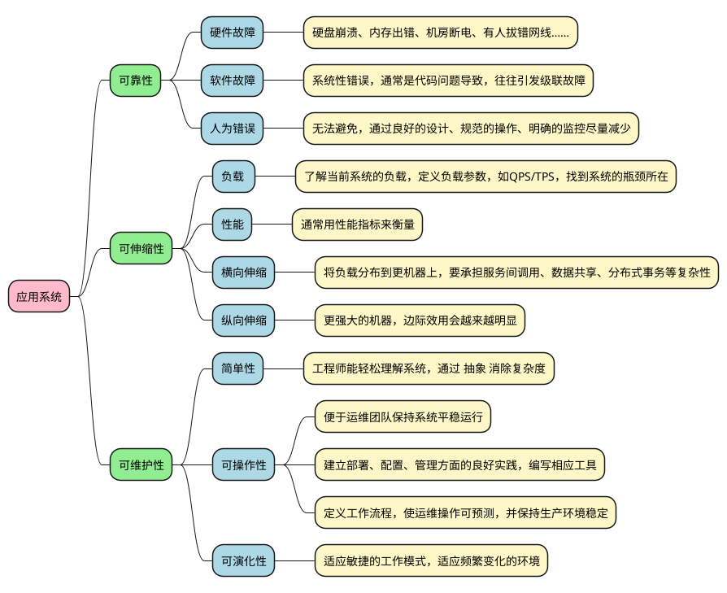
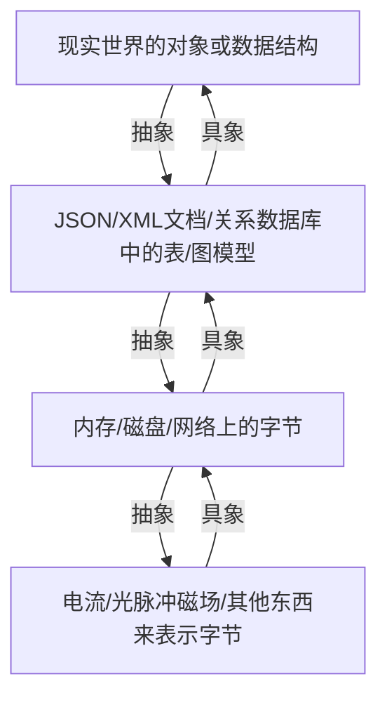
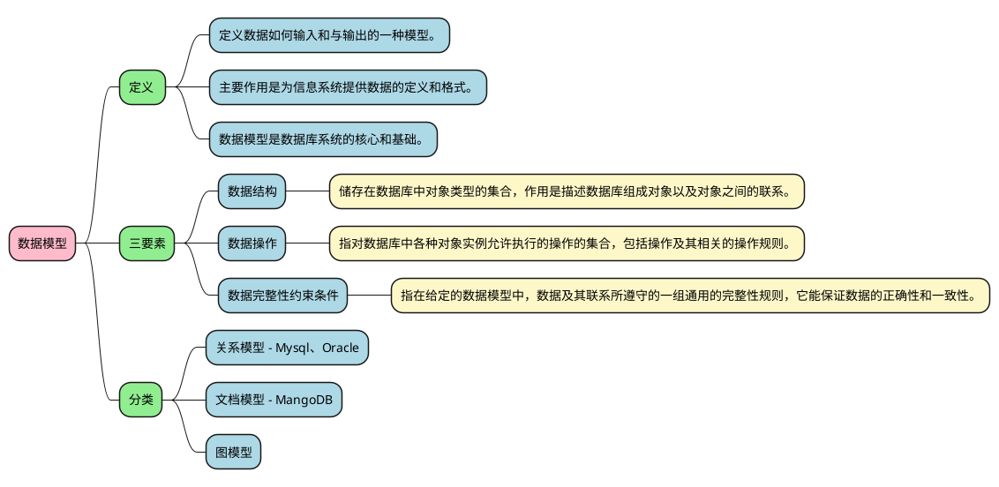
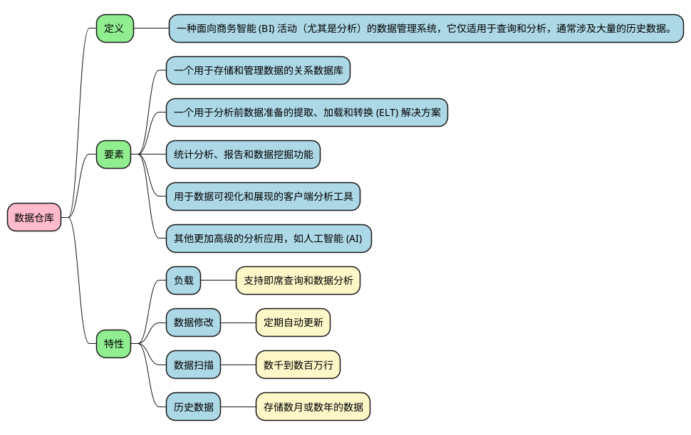
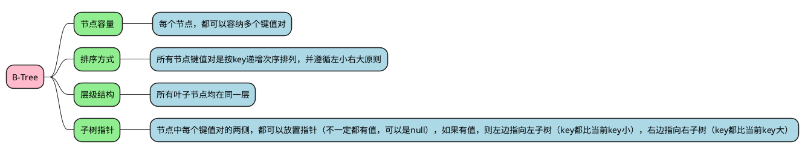

# 《设计数据密集型应用》-第一部分读书分享

原名：[《Designing Data-Intensive Applications》](https://www.oreilly.com/library/view/designing-data-intensive-applications/9781491903063/)

<div class="pt-12">
  <span @click="$slidev.nav.next" class="px-2 py-1 rounded cursor-pointer" hover="bg-white bg-opacity-10">
    开启阅读之旅 <carbon:arrow-right class="inline"/>
  </span>
</div>

<div class="abs-br m-6 flex gap-2">
  <button @click="$slidev.nav.openInEditor()" title="Open in Editor" class="text-xl icon-btn opacity-50 !border-none !hover:text-white">
    <carbon:edit />
  </button>
  <a href="https://github.com/Vonng/ddia" target="_blank" alt="GitHub"
    class="text-xl icon-btn opacity-50 !border-none !hover:text-white">
    <carbon-logo-github />
  </a>
</div>
<!--
The last comment block of each slide will be treated as slide notes. It will be visible and editable in Presenter Mode along with the slide. [Read more in the docs](https://sli.dev/guide/syntax.html#notes)
-->

---

# 主要内容
<br/>

**一、本书介绍**

**二、可靠性、可伸缩性、可维护性**

**三、数据模型与查询语言**

**四、存储与检索**

**五、编码与演化**

**六、本次分享总结**


---

# 一、本书介绍
  <br/>

  **1.1 这是一本什么样的书？**

  **1.2 这本书带给我的收获**

  **1.3 数据密集型应用的典型架构**

  **1.4 何为数据密集型应用？**
  
  **1.5 本章小结**


---

# 1.1 这是一本什么样的书？

[豆瓣](https://book.douban.com/subject/30329536/)评分高达 9.7 分。 关于数据库、分布式系统。 注定要成为经典的书。


---

# 1.2 这本书带给我的收获

1. 读完这本书，之后再读很多数据库和分布式系统相关的文章会轻松很多。
2. 脑海中第一次有了完整的数据系统体系。
3. 这本书可以帮助你在架构选型时，知道你选择的组件有哪些合适的场景，而不至于掉到坑里。


<Tweet id="1491177640660996100" scale="0.45" />

---

# 1.3 数据密集型应用的典型架构


---

# 1.4 何为数据密集型应用？

一个应用，如果数据是其主要挑战（比如数据量，数据复杂度，数据变化速度），那么就可以称为**数据密集型应用**。

大部分应用程序都是 **数据密集型（data-intensive）** 的，而非 **计算密集型（compute-intensive）** 。

数据密集型应用标准组件：

  - 数据库
  - 缓存
  - 搜索索引
  - 流处理
  - 批处理


## 举个🌰：回传服务

---

# 1.5 本章小结

  - 介绍了这本书的评价和带给我的收获
  - 介绍了什么是数据密集型应用和它的典型架构

--- 

# 二、可靠性、可伸缩性、可维护性
  <br/>

  **2.1 三个术语的定义**

  **2.2 三个术语的特性**

  **2.3 性能指标**

  **2.4 本章小结**

---

# 2.1 三个术语的定义

|  |  |
| --- | --- |
| <red>指标</red> | <red>描述</red> |
| <kbd>可靠性（Reliability）</kbd> | 系统在 困境（adversity，比如硬件故障、软件故障、人为错误）中仍可正常工作（正确完成功能，并能达到期望的性能水准） |
| <kbd>可伸缩性（Scalability）</kbd> | 有合理的办法应对系统的增长（数据量、流量、复杂性） |
| <kbd>可维护性（Maintainability）</kbd> | 许多不同的人（工程师、运维）在不同的生命周期，都能高效地在系统上工作（使系统保持现有行为，并适应新的应用场景） |

<style>
red {
  color: red
}
</style>

---

# 2.2 三个术语的特性



<style>
img {
  height: 90%
}
</style>

---

# 2.3 性能指标
  - **响应时间（RT）**- 客户端发送请求到接收响应之间的时间。
  - **系统处理能力** - 系统每秒钟能够处理的交易数量。
  - **并发用户** - 在同一时刻内，登录系统并进行业务操作的用户数量。
  - **错误率** - 系统在负载情况下，失败交易的概率。
---

## **响应时间**

**对于在线实时交易**：

  - 互联网企业：500毫秒以下，例如淘宝业务10毫秒左右。
  - 金融企业：1秒以下为佳，部分复杂业务3秒以下。
  - 保险企业：3秒以下为佳。
  - 制造业：5秒以下为佳。

**对于批量交易**：

大数据量的情况下，2小时内可完成压测。

---

## **系统处理能力**

  **用以下指标来度量：**

  - HPS（Hits Per Second） ：每秒点击次数，单位是次/秒。
  - TPS（Transaction per Second）：系统每秒处理交易数，单位是笔/秒。
  - QPS（Query per Second）：系统每秒处理查询次数，单位是次/秒。 
  
> 对于互联网业务中，一般情况下用TPS来衡量整个业务流程，用QPS来衡量接口查询次数，用HPS来表示对服务器单击请求。

  **用以下标准来度量：**

  - 金融行业：1000 TPS~50000 TPS，不包括互联网化的活动。
  - 保险行业：100 TPS~100000 TPS，不包括互联网化的活动。
  - 制造行业：10 TPS~5000 TPS。
  - 互联网电子商务：10000 TPS~1000000 TPS。
  - 互联网中型网站：1000 TPS~50000 TPS。
  - 互联网小型网站：500 TPS~10000 TPS。

---

## **并发用户**

<br/>

- 对于长连接系统来说最大并发用户数即是系统的并发能力
- 对于短连接类型的系统，使用吞吐量来衡量更适合，也是阿里的最佳实践，采用虚拟用户来模拟现实中用户进行业务操作。


<br/>
<br/>

## **错误率**

<br/>

- 错误率＝（失败交易数/交易总数）×100%
- 一般不超出千分之六，即成功率不低于99.4%


---

# 2.4 本章小结

  - 三个术语：可靠性、可伸缩性、可维护性的定义和特性
  - 性能指标的定义和参考标准

---

# 三、数据模型与查询语言

  <br/>

  **3.1 应用系统如何建模？**

  **3.2 数据模型**

  **3.3 非关系模型**

  **3.4 本章小结**

  

---

# 3.1 应用系统如何建模？

> 通过构建层层叠加的数据模型，每个层都通过提供一个明确的数据模型来隐藏更低层次中的复杂性。

如下图：



---

# 3.2 数据模型



---

# 数据模型的比较

|  |  |  |
| --- | --- | --- |
| <kbd>文档模型</kbd> | <kbd>关系模型</kbd> | <kbd>图模型</kbd> |
| 架构灵活性 | 更好的连接操作 | 复杂关联 |
| 由于局部性，性能更好 | 更好的多对一 | 多对多关系 |
| 读时模式 | 写时模式 | 三元存储模型：比如 Datomic、 AllegroGraph |
| 更新需要重写整个文档 | 强Schema约束 | 属性图模型：比如 Neo4j 、 Titan 和 InfiniteGraph |
| 始终读整个文档 | 多对多较弱 | 图处理框架：比如 Pregel |

---

# 通过需求说明文档模型和关系模型

需求：假设你把每个用户的全名存储在一个字段中，而现在想分别存储名字和姓氏。

文档数据库的处理：

```java
  user.first_name = user.name.split(" ")[0];
  user.last_name = user.name.split(" ")[1];
```

关系数据库的处理：

```sql
ALTER TABLE users ADD COLUMN first_name varchar(64);
ALTER TABLE users ADD COLUMN last_name varchar(64);
UPDATE users SET first_name = substring_index(name, ' ', 1);
UPDATE users SET last_name = substring_index(name, ' ', -1);
```


---

# 3.3 非关系模型
主要指 NoSQL，其提供数据模型、复制和分区等手段改进传统关系模型。
  - 更好的扩展性需求。
  - 丰富的免费和开源软件。
  - 满足特定需求的查询操作。
  - 更少限制、更具动态和表达力的数据模型（不对数据强加模式）。

|  |  |  |
| --- | --- | --- |
| <kbd>非关系模型</kbd> | <kbd>解决关系模型的问题</kbd> | <kbd>代表实现</kbd> |
| 键值数据库 | 无法存储数据结构 | Redis |
| 文档数据库 | 强 schema 约束，不够灵活 | MongoDB |
| 列式数据库 | 大数据场景下部分访问 I/O 性能差 | HBase |
| 全文搜索引擎 | 全文搜索性能差 | Elasticsearch |

---

# 3.4 本章小结

  - 应用系统如何建模：自底层向上隐藏实现细节
  - 数据模型的定义、三要素、分类
  - 文档模型、关系模型、图模型的比较
  - 非关系模型解决了关系模型哪些痛点

---

# 四、存储与检索

  <br/>

  **4.1 实现一个最简单的数据库**

  **4.2 OLTP or OLAP**

  **4.3 LSM-Tree**

  **4.4 B-Tree**

  **4.5 LSM-Tree vs B-Tree**

  **4.6 列式存储**

  **4.7 本章小结**


---

# 4.1 实现一个最简单的数据库

<uim-rocket class="text-1xl text-red-500 animate-ping" /> 

两个 Bash 函数实现：

```bash {all|1|2-4|6-8|all}
#!/bin/bash
db_set () {
  echo '$1,$2' >> database
}

db_get () {
  grep '^$1,' database | sed -e 's/^$1,//' | tail -n 1
}
```

这两个函数实现了键值存储的功能。执行 db_set key value 会将 键（key） 和 值（value） 存储在数据库中。键和值（几乎）可以是你喜欢的任何东西，例如，值可以是 JSON 文档。然后调用 db_get key 会查找与该键关联的最新值并将其返回。

---

调用函数

```bash 
$ db_set 42 '{"name":"San Francisco","attractions":["Exploratorium"]}'

$ db_get 42
{"name":"San Francisco","attractions":["Exploratorium"]}

$ cat database
123456,{"name":"London","attractions":["Big Ben","London Eye"]}
42,{"name":"San Francisco","attractions":["Golden Gate Bridge"]}
42,{"name":"San Francisco","attractions":["Exploratorium"]}
```

这里运用了日志结构的存储引擎，底层的存储格式非常简单：一个文本文件，每行包含一条逗号分隔的键值对（忽略转义问题的话，大致与 CSV 文件类似）。每次对 db_set 的调用都会向文件末尾追加记录，所以更新键的时候旧版本的值不会被覆盖 —— 因而查找最新值的时候，需要找到文件中键最后一次出现的位置（因此 db_get 中使用了 tail -n 1 )。


---

# 4.2 OLTP or OLAP

|  |  |  |
| --- | --- | --- |
| <kbd>属性</kbd> | <kbd>事务处理系统（OLTP）</kbd> | <kbd>分析系统（OLAP）</kbd> |
| 读特征 | 基于键，每次查询返回少量的记录 | 对大量记录进行汇总 |
| 写特征 | 随机访问，低延迟写入用户的输入 | 事件流或批量导入（ETL） |
| 使用场景 | 终端用户，通过网络应用程序 | 内部分析师，为决策提供支持 |
| 数据表征 | 最新的数据状态（当前时间点） | 随着时间而变化的所有事件历史 |
| 响应速度 | 快速及时 | 对时间要求不严格 |
| 备份频率 | 频繁、并发 | 不频繁 |
| 数据规模 | GB 到 TB | TB 到 PB |
| 主要应用 | 数据库 | 数据仓库 |

<br/>

---

# 4.2.1 系统中OLTP和OLAP的联合应用


---

# 4.2.2 事务处理系统（OLTP）
基于某种键查询记录，而存储引擎使用索引来查找所请求键的数据，磁盘寻道时间往往是瓶颈。

> 不建议在 OLTP 数据库上直接运行临时分析查询，需要扫描大量数据集，可能会损害并发执行事务的性能。

对于 OLTP 系统，主流的存储引擎：

  - 日志结构：只允许追加式更新文件和删除过时文件，不修改己写入的文件。比如 LSM-tree、LevelDB、Cassandra、HBase、Lucene 等。关键思想是系统地将随机写入转为顺序写入，由于硬盘驱动器和 SSD 的性能特性，可以实现更高的写入吞吐量。

  - 原地更新：以 B-Tree 为代表，将磁盘视为可覆盖的一组固定大小的页，用于主要的关系数据库和大量的非关系数据库。

---

# 4.2.3 分析系统（OLAP）

OLAP是数据仓库系统的主要应用，支持复杂的分析操作，侧重决策支持，并且提供直观易懂的查询结果。

1. 实时性要求不是很高，很多应用顶多是每天更新一下数据
2. 数据量大
3. 查询一般是动态的
4. 列式存储日益成为主流

<br/>

推荐阅读：

  - [什么是OLTP?](https://www.oracle.com/database/what-is-oltp/)
  - [OLAP数仓进阶：主流开源OLAP系统的分类及核心技术点](https://dbaplus.cn/news-73-3319-1.html)
  - [什么是OLAP？主流八大开源OLAP技术架构对比](https://segmentfault.com/a/1190000040428093)

---

# 4.2.4 数据仓库



<style>
img {
  height: 90%
}
</style>

---


# 4.3 LSM-Tree

LSM-Tree全称是Log Structured Merge Tree，是一种分层，有序，面向磁盘的数据结构，其核心思想是充分利用了，磁盘批量的顺序写要远比随机写性能高出很多，如下图示：


  - 以Append的模式追加，不存在删除和修改。
  - 适合于写多读少的场景
  - 典型的例子Kakfa、MySQL的Binlog


---

## 完整的LSM-Tree图示


在LSM-Tree里面，核心的数据结构就是SSTable，全称是Sorted String Table。SSTable是一种拥有持久化，有序且不可变的的键值存储结构，它的key和value都是任意的字节数组，并且了提供了按指定key查找和指定范围的key区间迭代遍历的功能。


---

## LSM-Tree如何写数据?

  <br/>

  1. 当收到一个写请求时，会先把该条数据记录在`WAL Log（预写日志）`里面，用作故障恢复。
  2. 当写完WAL Log后，会把该条数据写入内存的SSTable里面，也称 `Memtable`。
  3. 当Memtable超过一定的大小后，会在内存里面冻结，变成 `不可变的Memtable`，同时为了不阻塞写操作需要新生成一个Memtable继续提供服务。
  4. 把内存里面不可变的Memtable给flush到硬盘上的SSTable层中，此步骤也称为Minor Compaction。**这个过程是将小的、相邻的数据合并成大的数据**。
  5. 当每层的磁盘上的SSTable的体积超过一定的大小或者个数，也会周期的进行合并，此步骤也称为Major Compaction。**这个过程会清理删除的数据、TTL的数据、版本号超过设定版本号的数据。**

  <br/>

## LSM-Tree如何读数据?

  <br/>

  1. 当收到一个读请求的时候，会直接先在内存里面查询，如果查询到就返回。
  2. 如果没有查询到就会依次下沉，知道把所有的Level层查询一遍得到最终结果。

---

# 4.4 B-Tree
B-Tree是一种自平衡的树，能够保持数据有序。


这里面，每个字母，都表示一个键值对`[key,value]`，在关系型数据库的使用场景中，**key一般是索引值**（如果是主键索引的话，那就是ID字段，如果是普通索引，那就是索引对应的字段值，如果是联合索引，可以简单理解为对应多个字段的拼接），**value一般是指向行数据的指针**（聚簇索引是这样）**或者主键id**（非聚簇索引）；


--- 


通过上图可以总结：



---

B-Tree将数据库分解成固定大小的块（block）或页面（page），传统上大小为 4KB（有时会更大），并且一次只能读取或写入一个页面。

比如MySQL的InnoDB存储引擎中有页（Page）的概念，页是其磁盘管理的最小单位。InnoDB存储引擎中默认每个页的大小为16KB，可通过参数innodb_page_size将页的大小设置为4K、8K、16K，在MySQL中可通过如下命令查看页的大小：

```sql
mysql> show variables like 'innodb_page_size';
```

每个页面都可以使用地址或位置来标识，这允许一个页面引用另一个页面 —— 类似于指针，但在硬盘而不是在内存中。我们可以使用这些页面引用来构建一个页面树。

## B+Tree的延伸阅读
<br/>

  - https://en.wikipedia.org/wiki/B%2B_tree
  - https://www.programiz.com/dsa/b-plus-tree
  - https://www.javatpoint.com/b-plus-tree

---

## 使用 B 树索引查找一个键


一个页面会被指定为 B 树的根；在索引中查找一个键时，就从这里开始。该页面包含几个键和对子页面的引用。每个子页面负责一段连续范围的键，引用之间的键，指明了引用子页面的键范围。

最终，我们将到达某个包含单个键的页面（叶子页面，leaf page），分支因子为6。

---

# 4.5 LSM-Tree vs B-Tree

|  |  |  |
| --- | --- | --- |
|  | <kbd>LSM-Tree</kbd> | <kbd>B-Tree</kbd> |
| 写入吞吐量 | 写放大较低，顺序写比随机写快得多 | 写入时需要写预写日志和树的页 |
| 读取效率 | 较慢 | 快 |
| 压缩支持 | 更好地支持压缩，磁盘文件比 B-tree 小很多 | 面向页存储，会出现碎片 |
| 响应延迟 | 压缩有时会干扰读写 | 响应延迟更具确定性 |
| 磁盘带宽 | 磁盘写入带宽有限 |  |
| 副本数量 | 可能在不同的段中具有相同键的多个副本 | 每个键都唯一对应于索引中的某个位置 |
| 事务隔离 | 不支持 | 通过键范围上的锁支持 |
| 范围查询 | 效率较低 | 支持 |

---

# 4.6 列式存储

列式存储数据库是以列相关存储架构进行数据存储的数据库，主要适合于批量数据处理和即时查询.


如上图的实体-对象模型，通过简化的方式表达：

行存储可以表示为

```json
1,Smith,Joe,40000;2,Jones,Mary,50000;3,Johnson,Cathy,44000;
```

列存储可以表示为

```json
1,2,3;Smith,Jones,Johnson;Joe,Mary,Cathy;40000,50000,44000; 
```


--- 

## 行存储与列存储的简单比较

|  |  |  |
| --- | --- | --- |
| <kbd>行存储</kbd> | <kbd>列存储</kbd> |
| 读取数据有冗余 | 可以只读取必要的列 |
| 写入效率高，提供数据完整性保证 | 写入效率低，缺乏数据完整性保证 |
| 适合 OLTP 系统 | 适合 OLAP 系统 |
| 不利于大数据集的聚合统计操作 | 利于大数据集的数据聚合操作 |
| 不利于压缩数据 | 利于压缩数据 |

---

# 4.7 本章小结

  1. 存储引擎分为两大类：针对 事务处理（OLTP） 的存储引擎和针对 在线分析（OLAP） 优化的存储引擎。
  2. OLTP系统分为两大主流存储引擎：日志结构和就地更新。
  3. OLAP系统：实时性不高，数据量大，动态查询，列式存储。
  4. 数据仓库的定义、要素、特性。
  5. LSM-Tree、B-Tree的介绍和比较。
  6. 列式存储的介绍
--- 


# 五、编码与演化

  <br/>

  **5.1 数据编码格式**

  **5.2 数据流的类型**

  **5.3 本章小结**

---

# 5.1 数据编码格式

程序通常（至少）使用两种形式的数据：

  1. 在内存中，数据保存在对象、结构体、列表、数组、散列表、树等中。 这些数据结构针对 CPU 的高效访问和操作进行了优化（通常使用指针）。
  2. 如果要将数据写入文件，或通过网络发送，则必须将其 编码（encode） 为某种自包含的字节序列（例如，JSON 文档）。 由于每个进程都有自己独立的地址空间，一个进程中的指针对任何其他进程都没有意义，所以这个字节序列表示会与通常在内存中使用的数据结构完全不同 。
   
所以，需要在两种表示之间进行某种类型的翻译。 从内存中表示到字节序列的转换称为 `编码（Encoding）` （也称为 序列化（serialization） 或 编组（marshalling）），反过来称为 `解码（Decoding）`（解析（Parsing），反序列化（deserialization），反编组 (unmarshalling））。

<br/>

**文本格式的编码**：JSON、XML、CSV、...

**二进制编码**：高效，读之前需要对数据进行解码，Thrift、Protocol Buffers、Avro、...

---


# 5.2 数据流的类型

常见的方式：

  - 通过数据库
  - 通过服务调用
  - 通过异步消息传递

## 基于数据库的数据流

数据库除了实时更新的数据外，还会存储很多年的数据，因此向前兼容是极为必要的。而对于 OLTP 的数据库来说，滚动发布时会同时存在新旧代码，旧代码读新代码写进去的数据也是有可能的，因此向后兼容也需要处理。


另外需要注意的一点是有些代码会读取数据库的内容并更新再写回去，这时候如果旧代码读取了新代码的数据，会损失新加的字段，写回去的时候就会导致数据的丢失。

--- 

## 基于服务的数据流：REST 和 RPC

服务通信有两种，一种是客户端与服务端的通信，这里的服务端提供的是公开的 API。另外一种是服务与其他服务的通信，常见于公司内部。

这里的服务有点像数据库，允许客户端查询或提交数据，只是服务会比数据库更加粗粒度，服务提供的是业务逻辑对应的封装好的操作。通常不同服务会由不同的团队维护，每个服务都是独立发布和演化的，API 的兼容尤其重要。

## 基于消息队列的数据流

消息队列是一个异步的消息传递系统，相比于 RPC，消息代理可以起到解耦，削峰填谷的作用，还可以支持发布-订阅模式，消息自动重发等强大的功能，非常适用于不要求实时性的场景，缺点是消息传递式单向的，消息发送者不会等待响应。

---

# 5.3 本章小结

  <br/>

  - 几种数据编码格式及其兼容性属性
  - 数据流的几种模式

---

# 六、本次分享总结

> 其实我们平时遇到的大部分系统都是数据密集型的——应用代码访问内存、硬盘、数据库、消息队列中的数据，经过业务逻辑处理，再返回给用户。

  - 很多应用都是在解决不同场景下的数据存储和检索问题——MySQL，Redis，HBase，Kafka，ElasticSearch……

  - 还有很多技术是围绕着数据展开——索引，编码（JSON, XML, Thrift, ProtoBuffer），行列存储……
  - 当数据在分布式处理时，要考虑——数据复制，分区，事务……
  - 大数据场景下，我们会使用——MapReduce，Spark，Flink 等批处理、流处理框架。

<br/>

这本书，解决了之前我对「数据」的理解只浮于表面、而没有深究的问题。

建议看的时候，一边读，一边做笔记。虽然读得比较慢，但是收获会更多。

---

<div class="relative mt-6">
  <div class="relative w-40 h-40">
    
    
    
  </div>

  <div
    class="text-5xl absolute top-14 left-40 text-[#2B90B6] -z-1"
    v-motion
    :initial="{ x: -80, opacity: 0}"
    :enter="{ x: 0, opacity: 1, transition: { delay: 2000, duration: 1000 } }">
    Thanks For Watching 
  </div>
</div>

<!-- vue script setup scripts can be directly used in markdown, and will only affects current page -->
<script setup lang="ts">
const final = {
  x: 0,
  y: 0,
  rotate: 0,
  scale: 1,
  transition: {
    type: 'spring',
    damping: 10,
    stiffness: 20,
    mass: 2
  }
}
</script>

<div
  v-motion
  :initial="{ x:35, y: 40, opacity: 0}"
  :enter="{ y: 0, opacity: 1, transition: { delay: 3500 } }">

油管上有个很不错的 Book Review，每一章都会讲到，全英文的，作者很用心。

<Youtube id="PdtlXdse7pw"/>

[🎄阿里云盘分享🎄](https://www.aliyundrive.com/s/gPURi798Qih)

[🎄DDIA作者Martin Kleppmann的播客🎄](https://www.youtube.com/watch?v=grGqCuTcu50)

</div>

